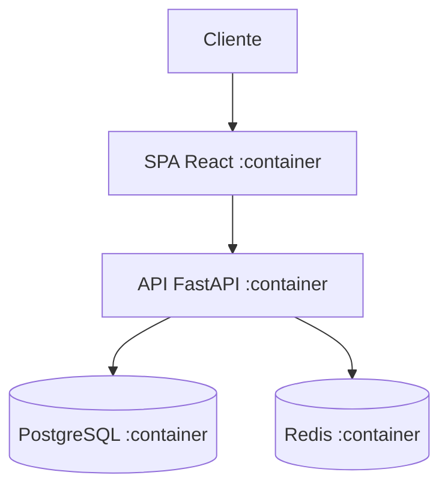

# C4 Model

## Resumo

O **C4 Model** é uma notação **leve** para modelar a **arquitetura** de sistemas de software em **quatro níveis de zoom** — **Context, Container, Component, Code** — como um mapa com escalas diferentes. Criado por **Simon Brown** (2006–2011), baseado em UML e no modelo 4+1. Popularizado por site oficial (Creative Commons) e artigo em 2018.

## O que é?

Uma decomposição hierárquica do sistema em **containers** e **components**, apoiando-se em notações existentes ([[UML - Diagramas Essenciais|UML]], [[Diagrama Entidade-Relacionamento (ER)|ER]]) para os detalhes. Resolve o problema de diagramas de arquitetura confusos e inconsistentes, dando **níveis de abstração** claros.

## Os 4 níveis (do mais amplo ao mais detalhado)

### Nível 1 — Context (Contexto)
O sistema como uma **caixa preta**, seus **usuários** (personas) e os **sistemas externos** com que interage. Público: **todos** (inclusive não técnicos).

### Nível 2 — Container
Decompõe o sistema em **containers**: aplicações e **data stores** (ex.: app web, API, banco, SPA, mobile). Mostra as principais escolhas tecnológicas e como se comunicam. Público: técnicos/arquitetos.

### Nível 3 — Component
Decompõe **um container** em **componentes** (agrupamentos de funcionalidade) e suas relações. Público: desenvolvedores.

### Nível 4 — Code
Detalhe de implementação de um componente (classes/interfaces) — geralmente **UML/ER** ou gerado pelo IDE. Raramente mantido à mão (muda rápido).

> Elementos básicos (níveis 1–3): **person, software system, container, component, relationship**. Simples de propósito.

## Analogia do mapa

C4 é como o **Google Maps**: nível 1 = mapa-múndi (contexto), nível 2 = país (containers), nível 3 = cidade (components), nível 4 = rua (código). Você escolhe o **zoom** conforme a audiência.

## Por que existe?

Diagramas de arquitetura costumam ser inconsistentes e ambíguos ("caixas e setas" sem significado claro). O C4 dá um **conjunto pequeno e consistente** de abstrações e níveis, fácil de aprender e comunicar — sem a complexidade de UML completa.

## Exemplo (Container, em Mermaid)

## Quando utilizar

- Comunicar arquitetura a **audiências diferentes** (do executivo ao dev).
- Onboarding, documentação de arquitetura, revisões de design ([[45 - DECISOES ARQUITETURAIS/_INDEX|ADRs]]).
- Especialmente útil em [[Microsservicos|sistemas distribuídos]].

## Quando NÃO utilizar (nuance)

- Nível 4 (Code) raramente compensa manter (muda demais; deixe o IDE gerar).
- Sistema trivial pode precisar só do nível 1–2.

## Trade-offs

- **Ganha:** simples, consistente, escalável em detalhe, independente de ferramenta.
- **Perde:** menos expressivo que UML completa para certos aspectos comportamentais (use UML/sequência junto quando precisar).

## Erros comuns / Anti-patterns

- Misturar níveis num mesmo diagrama (contexto + código juntos → confusão).
- "Caixas e setas" sem legenda/significado consistente.
- Manter o nível Code à mão (fica obsoleto).

## Boas práticas

- Comece pelo **Context** e desça só o necessário.
- Um diagrama por nível/audiência; legenda clara.
- **C4 como código** (Structurizr, Mermaid, PlantUML-C4) versionado.
- Combinar: C4 para arquitetura, [[UML - Diagramas Essenciais|UML sequência]] para fluxos específicos.

## Conceitos relacionados

- [[Modelagem de Software - Fundamentos]]
- [[UML - Diagramas Essenciais]]
- [[Arquitetura de Software - Fundamentos]]
- [[Microsservicos]]
- [[45 - DECISOES ARQUITETURAIS/_INDEX|ADRs]]

## Perguntas importantes

### Quais são os 4 níveis do C4?
**Context** (sistema + usuários + sistemas externos), **Container** (apps e data stores), **Component** (dentro de um container), **Code** (classes — opcional).

### C4 substitui UML?
Não; complementa. C4 organiza a **visão de arquitetura** em níveis; para detalhes comportamentais, use UML (sequência, estados). C4 inclusive se apoia em UML/ER no nível Code.

## Fontes

1. Wikipedia — C4 model — https://en.wikipedia.org/wiki/C4_model (consultado 2026-09-03)
2. Simon Brown — https://c4model.com
3. Kruchten, P. — modelo de visões 4+1 (base conceitual).

## Observações

Aprofundar: Structurizr DSL, C4-PlantUML, System Landscape diagrams. Status: verified.
