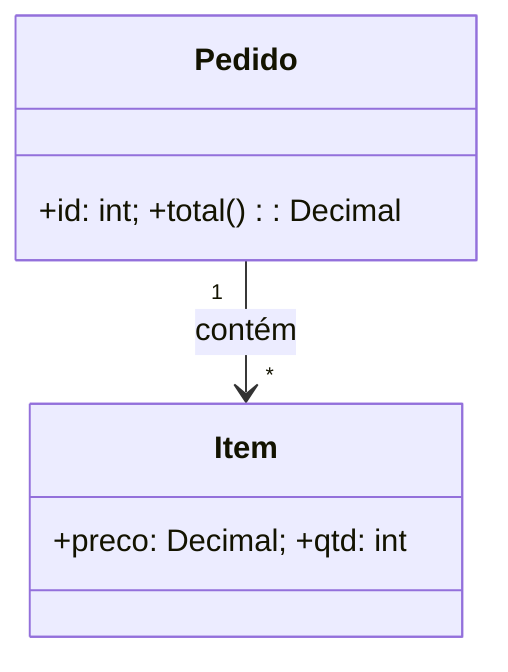

# Modelagem de Software — Fundamentos

## Resumo

**Modelagem** é criar **abstrações visuais ou formais** de um sistema — diagramas, esquemas, modelos — para **raciocinar, comunicar e projetar** antes (e durante) a construção. Um modelo é um mapa, não o território: simplifica a realidade para focar no que importa.

## O que é?

Representar aspectos de um sistema (estrutura, comportamento, dados, fluxos) de forma abstrata. Notações comuns: **[[UML - Diagramas Essenciais|UML]]**, **[[C4 Model|C4]]**, **[[Diagrama Entidade-Relacionamento (ER)|ER]]**, **BPMN** (processos), fluxogramas.

## Por que existe?

- **Comunicar** design entre pessoas (blueprint comum).
- **Raciocinar** sobre o sistema antes de codar (barato mudar um diagrama).
- **Documentar** decisões e a arquitetura.
- **Alinhar** negócio e técnica ([[Domain-Driven Design (DDD)|linguagem ubíqua]]).

## Níveis de modelo

- **Conceitual** — o quê, no nível de negócio (entidades e relações, alto nível).
- **Lógico** — estrutura independente de tecnologia (ex.: modelo de dados normalizado, classes).
- **Físico** — implementação concreta (tabelas do SGBD, deployment).

## O que modelar (por aspecto)

- **Estrutura** — classes, componentes, dados ([[UML - Diagramas Essenciais|diagrama de classes]], [[Diagrama Entidade-Relacionamento (ER)|ER]]).
- **Comportamento** — fluxos, estados, casos de uso.
- **Interação** — sequência de mensagens entre objetos/serviços.
- **Arquitetura** — visão de alto nível ([[C4 Model|C4]], 4+1 views).
- **Processos de negócio** — BPMN.

## Modelagem "just enough"

A maioria dos devs **não usa UML formal**; produz diagramas **informais** (muitas vezes à mão) que incorporam elementos de UML. O objetivo é **comunicar**, não seguir a notação à risca. Modele **o suficiente** para o propósito e descarte quando não agregar mais.

## Diagramas como código

Ferramentas texto→diagrama versionáveis no [[Git - Fundamentos|Git]]:
- **Mermaid** (renderiza em Markdown/Obsidian), **PlantUML**, **Structurizr** (C4).
Vantagem: versionar, revisar e manter os diagramas junto do código (docs-as-code).

## Exemplo (Mermaid)

## Quando utilizar

- Para **comunicar** arquitetura/design a outras pessoas.
- Antes de decisões caras (arquitetura, modelo de dados).
- Onboarding e documentação viva.

## Quando NÃO utilizar (nuance)

- Modelagem detalhada de tudo (BDUF) em contexto ágil/incerto → desperdício.
- Diagramas que ninguém mantém → viram mentira (pior que nada). Prefira poucos e atualizados.

## Trade-offs

- Modelo detalhado comunica mais, mas custa manter (fica desatualizado).
- Informal é rápido, mas menos preciso. Escolha pelo público/propósito.

## Erros comuns / Anti-patterns

- **Diagramas desatualizados** que divergem do código.
- Modelar por obrigação, não para comunicar.
- Excesso de detalhe (UML "astronaut architecture").
- Um único diagrama gigante ilegível (falta de níveis — ver [[C4 Model|C4]]).

## Boas práticas

- Modelar **just enough**; escolher a notação pelo público.
- **Diagramas como código** (Mermaid/PlantUML) versionados.
- Vários **níveis** de abstração (C4) em vez de um mega-diagrama.
- Manter perto do código e atualizar (ou descartar).

## Conceitos relacionados

- [[UML - Diagramas Essenciais]]
- [[C4 Model]]
- [[Diagrama Entidade-Relacionamento (ER)]]
- [[Arquitetura de Software - Fundamentos]]
- [[Domain-Driven Design (DDD)]]

## Perguntas importantes

### Preciso usar UML formal?
Não. A maioria usa diagramas informais com elementos de UML. O objetivo é **comunicar**; use a notação como ferramenta, não como regra.

### Por que "diagramas como código"?
Para versionar, revisar e manter os diagramas junto do código (docs-as-code), evitando que fiquem desatualizados em ferramentas separadas.

## Fontes

1. Wikipedia — Unified Modeling Language — https://en.wikipedia.org/wiki/Unified_Modeling_Language (consultado 2026-09-03)
2. Simon Brown — C4 Model — https://c4model.com
3. Fowler, M. — *UML Distilled.*

## Observações

Aprofundar: BPMN, 4+1 views, Structurizr. Status: verified.
