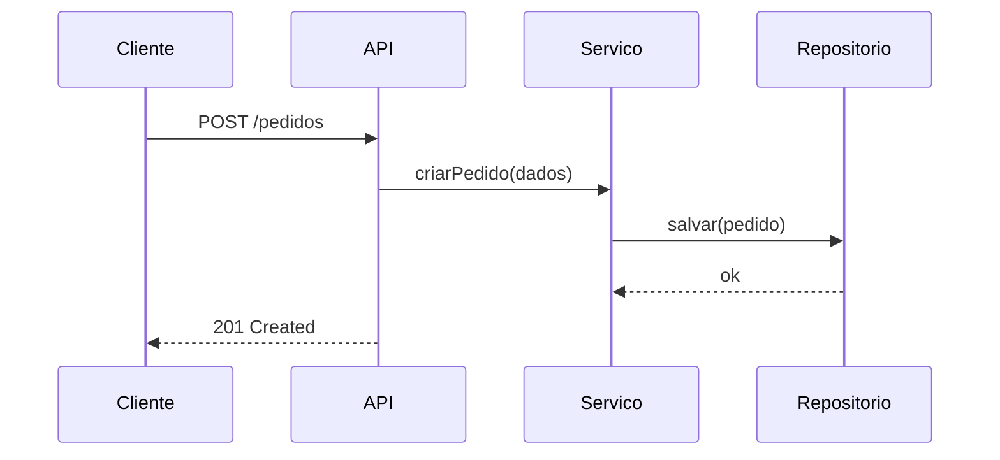

# UML — Diagramas Essenciais

## Resumo

**UML (Unified Modeling Language)** é uma linguagem de modelagem visual, orientada a objetos e de propósito geral, para **visualizar a arquitetura e o design** de um sistema — como um blueprint. Define **14 tipos de diagrama** (estruturais e comportamentais). É padrão da **OMG** (1997) e **ISO/IEC 19501**.

## O que é?

Notação padronizada para descrever sistemas. Criada por **Grady Booch, James Rumbaugh e Ivar Jacobson** (os "Três Amigos") na Rational Software, unificando métodos rivais; adotada pela **OMG** em 1997. Na prática, a maioria usa **um subconjunto** (poucos diagramas realmente pegam).

## As duas famílias

### Estruturais (o que o sistema É)
- **Diagrama de Classes** ⭐ — classes, atributos, métodos e relações (associação, herança, composição). O mais usado.
- **Diagrama de Componentes** — módulos/componentes e interfaces.
- **Diagrama de Deployment** — nós físicos/infra onde roda.
- **Diagrama de Objetos**, **Pacotes**.

### Comportamentais (o que o sistema FAZ)
- **Diagrama de Casos de Uso** ⭐ — atores e funcionalidades (liga a [[User Stories, Casos de Uso e Criterios de Aceite|requisitos]]).
- **Diagrama de Sequência** ⭐ — troca de mensagens entre objetos **ao longo do tempo** (ótimo para fluxos/APIs).
- **Diagrama de Atividades** — fluxo de trabalho/processo (tipo fluxograma).
- **Diagrama de Estados (State Machine)** — estados de um objeto e transições.
- Comunicação, Timing, etc.

> Os "3 essenciais" no dia a dia: **Classes**, **Sequência** e **Casos de Uso**.

## Relações no diagrama de classes

- **Associação** — "usa/conhece" (linha).
- **Herança/Generalização** — "é-um" (triângulo).
- **Composição** — "parte-de" forte (a parte morre com o todo; losango preenchido).
- **Agregação** — "parte-de" fraca (losango vazado).
- **Dependência** — usa temporariamente (linha tracejada).
- **Cardinalidade/multiplicidade** — 1, 0..1, *, 1..*.

## Exemplo (sequência, em Mermaid)

## Quando utilizar cada um

- **Classes** — modelar domínio/estrutura OO; antes de implementar.
- **Sequência** — entender/documentar um fluxo entre componentes/serviços (debug de interação).
- **Casos de uso** — comunicar escopo funcional a stakeholders.
- **Estados** — objetos com ciclo de vida rico (pedido: pendente→pago→enviado).
- **Deployment** — comunicar infraestrutura.

## Quando NÃO utilizar

- Modelar **tudo** formalmente (BDUF) → desperdício. Use o diagrama que **comunica** o ponto.
- Manter dezenas de diagramas que ninguém atualiza.

## Erros comuns / Anti-patterns

- Confundir composição × agregação × associação.
- Diagrama de classes virar "cópia do código" sem valor de comunicação.
- Excesso de detalhe/notação obscura que ninguém lê.
- Diagramas desatualizados.

## Boas práticas

- Use **poucos diagramas**, no nível certo de abstração.
- Prefira clareza à conformidade estrita com a notação.
- **UML como código** (PlantUML/Mermaid) versionado no [[Git - Fundamentos|Git]].
- Combine com [[C4 Model|C4]] para visão de arquitetura (C4 no alto nível, UML nos detalhes).

## Conceitos relacionados

- [[Modelagem de Software - Fundamentos]]
- [[C4 Model]]
- [[Orientacao a Objetos]] (classes, herança, composição)
- [[User Stories, Casos de Uso e Criterios de Aceite]]
- [[Diagrama Entidade-Relacionamento (ER)]]

## Perguntas importantes

### Quantos diagramas UML existem?
**14** tipos (estruturais + comportamentais). Na prática, poucos são usados regularmente — classes, sequência e casos de uso são os mais comuns.

### Quando usar diagrama de sequência?
Para mostrar **a ordem das interações/mensagens** entre objetos ou serviços ao longo do tempo — ótimo para documentar fluxos de API e entender comportamento.

## Fontes

1. Wikipedia — Unified Modeling Language — https://en.wikipedia.org/wiki/Unified_Modeling_Language (consultado 2026-09-03)
2. OMG UML Specification — https://www.omg.org/spec/UML
3. Fowler, M. — *UML Distilled.*

## Observações

Aprofundar: composição vs agregação, state machines, activity diagrams. Status: verified.
