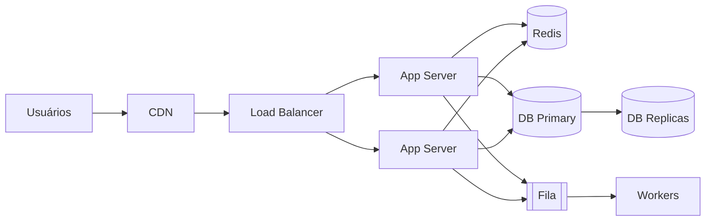

# Arquitetura de Sistemas e System Design — Fundamentos

## Resumo

**Arquitetura de sistemas** é o modelo conceitual que define a **estrutura, o comportamento e as visões** de um sistema completo — seus **componentes, subsistemas e as relações** entre eles e com o ambiente. **System Design** é a prática de projetar esses sistemas em larga escala, tomando decisões de alto nível para atender requisitos funcionais e, sobretudo, **não funcionais**.

## O que é? (e diferença para 09)

- **[[Arquitetura de Software - Fundamentos|Arquitetura de Software (09)]]** — foca na estrutura interna de **um** aplicativo (camadas, módulos, padrões).
- **Arquitetura de Sistemas (10)** — foca no **sistema completo**: múltiplos serviços, bancos, caches, filas, integrações e infraestrutura trabalhando juntos em escala.

É o conjunto de **decisões top-level, estratégicas e difíceis de mudar** sobre a organização geral do sistema, mapeando funcionalidade em componentes de software/hardware.

## Por que existe?

Sistemas reais atendem muitos usuários, integram várias partes e têm requisitos exigentes de escala, disponibilidade e latência. Projetar isso exige raciocinar sobre o **todo** — não dá para "só codar". System design guia essas escolhas de forma deliberada.

## Como funciona? — Dirigido por requisitos não funcionais

O design de sistema é guiado pelos [[Requisitos Nao Funcionais|NFRs]] / atributos de qualidade:
- **Escalabilidade** — crescer com a carga ([[22 - ESCALABILIDADE/_INDEX]]).
- **Disponibilidade** — uptime (redundância, failover).
- **Latência/Performance** — resposta rápida ([[Performance - Fundamentos]]).
- **Consistência** — trade-off com disponibilidade ([[Teorema CAP e Sistemas Distribuidos|CAP]]).
- **Confiabilidade/Tolerância a falhas**; **Segurança**; **Custo**; **Manutenibilidade**.

> Regra que atravessa tudo: **capacity estimation** — estimar carga (req/s), dados (GB/TB) e crescimento antes de escolher componentes.

## Building blocks (blocos de construção)

Ver detalhes em [[Componentes de Sistemas em Larga Escala]]:
- **Load Balancer**, **CDN**, **Cache** ([[Cache e Redis]]).
- **Bancos** com **replicação** e **[[Teorema CAP e Sistemas Distribuidos|sharding]]**.
- **Filas/[[Mensageria - Fundamentos|mensageria]]** para desacoplar.
- **API Gateway**, **[[Microsservicos|serviços]]**.

E a **integração** entre eles: [[Integracao de Sistemas]].

## Escala vertical vs horizontal

- **Vertical (scale up)** — máquina maior. Simples, mas tem teto e ponto único de falha.
- **Horizontal (scale out)** — mais máquinas. Escala "infinita", mas exige [[Teorema CAP e Sistemas Distribuidos|sistemas distribuídos]], stateless e load balancing.

## Exemplo (visão de sistema, Mermaid)

## Quando aplicar system design

- Projetar um sistema novo de médio/grande porte.
- Antes de escolher tecnologias/infra (decisões caras).
- Entrevistas técnicas de "system design".

## Quando NÃO exagerar (nuance)

- MVP/produto pequeno → **comece simples** (monolito modular, um banco). Adote componentes (cache, fila, sharding) **quando um NFR medido exigir** — não antecipe complexidade ([[DRY, KISS e YAGNI|YAGNI]]).

## Trade-offs

Tudo é trade-off: consistência × disponibilidade ([[Teorema CAP e Sistemas Distribuidos|CAP]]), simplicidade × escala, custo × performance. O design **prioriza** conforme o domínio.

## Erros comuns / Anti-patterns

- Over-engineering "para escala do Google" sem necessidade.
- Ignorar capacity estimation (dimensionar no escuro).
- Ponto único de falha (SPOF) não tratado.
- Estado na aplicação impedindo escala horizontal (não-stateless).

## Boas práticas

- Comece pelos **NFRs** e pela **estimativa de carga**.
- **Stateless** nos servidores de aplicação (escala horizontal).
- Redundância/failover para disponibilidade; medir e evoluir.
- Documentar decisões ([[45 - DECISOES ARQUITETURAIS/_INDEX|ADRs]]) e visões ([[C4 Model|C4]]).

## Conceitos relacionados

- [[Componentes de Sistemas em Larga Escala]]
- [[Integracao de Sistemas]]
- [[Processo de System Design]]
- [[Arquitetura de Software - Fundamentos]] · [[Microsservicos]]
- [[Teorema CAP e Sistemas Distribuidos]] · [[22 - ESCALABILIDADE/_INDEX]]

## Perguntas importantes

### Qual a diferença entre arquitetura de software e de sistemas?
Software (09) = estrutura interna de **uma** aplicação. Sistemas (10) = o **conjunto** de aplicações, dados e infra em escala e como se integram.

### Escala vertical ou horizontal?
Vertical (máquina maior) é simples, mas limitada. Horizontal (mais máquinas) escala muito mais, exigindo stateless, load balancing e lidar com sistemas distribuídos.

## Fontes

1. Wikipedia — Systems architecture — https://en.wikipedia.org/wiki/Systems_architecture (consultado 2026-09-03)
2. Alex Xu — *System Design Interview* (Vol. 1 e 2).
3. Kleppmann — *Designing Data-Intensive Applications.*

## Observações

Aprofundar: capacity estimation, back-of-the-envelope, 4+1 views. Status: verified.
